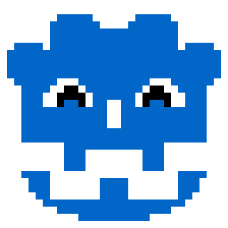
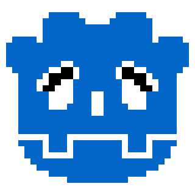
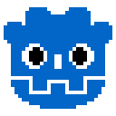
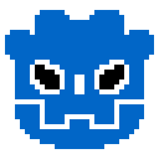
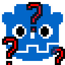

# Godot GIF Project

- Open source godot emoji project.
- More emojis are under development.
- Aseprite source file included.

Below is a list of all the GIF images in this project.

## GIF Images

### **smile.gif**

### **cry.gif**

### **yes.gif**

### **no.gif**

### **idle.gif**

### **talk.gif**

### **like.gif**

### **split.gif**

### **laser.gif**

### **angry.gif**

### **question.gif**

